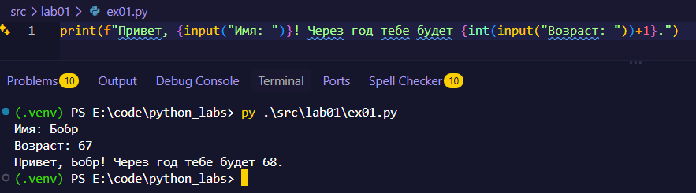
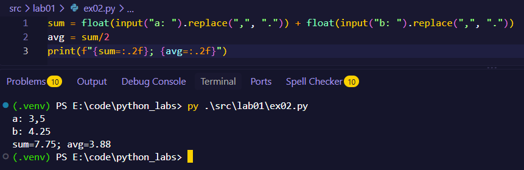
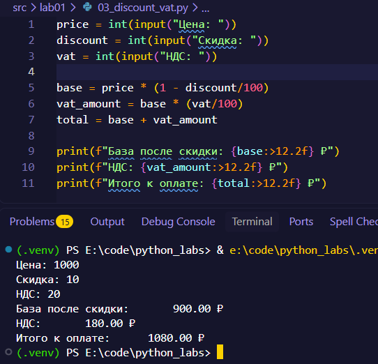
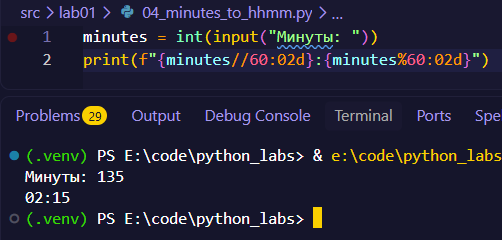
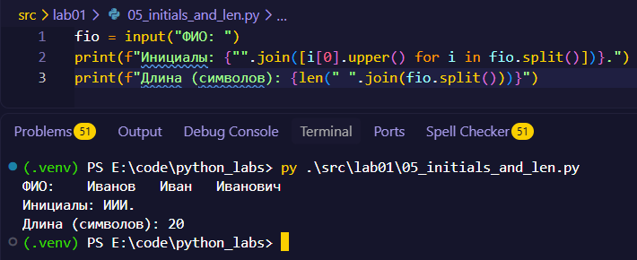
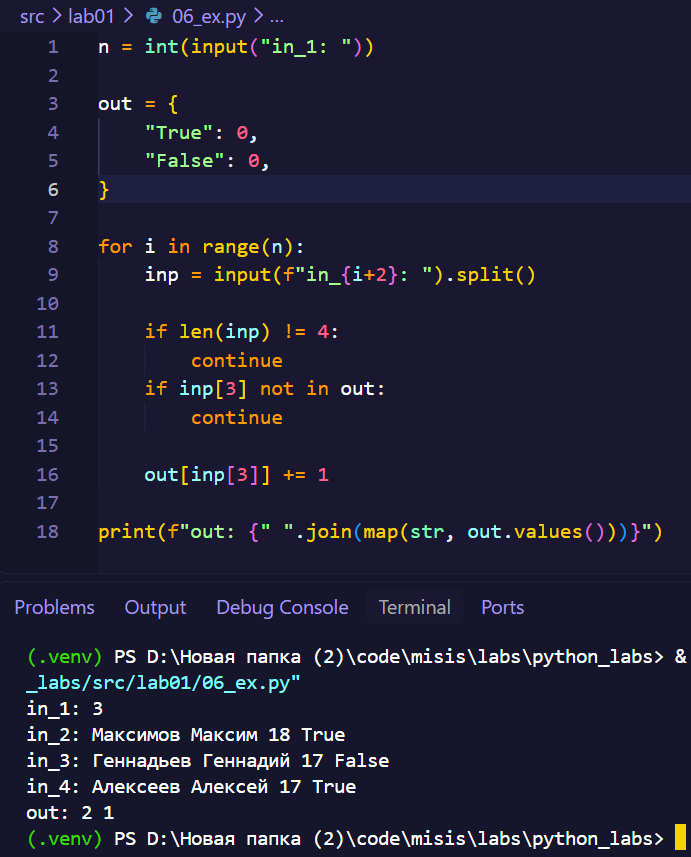
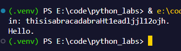

# ЛР1 - Ввод/вывод и форматирование.

---

## FastTravel
- [Задание 1](#задание-1)
- [Задание 2](#задание-2)
- [Задание 3](#задание-3)
- [Задание 4](#задание-4)
- [Задание 5](#задание-5)
- [Задание 6](#задание-6)
- [Задание 7](#задание-7)
- [P.S.](#ps)

---

## Задание 1
Тут нечего объяснять.

## Задание 2
Использовал имя sum, так как подозреваю, что задание нацелено на проверку умения работы с форматированием {var=}. Надеюсь, это не будет проблемой.

## Задание 3
Сделать такое же выравнивание, как в задании, без использования str.rjust или других вычислений - невозможно, если не хардкодить.

## Задание 4
Условие чуть-чуть перечит самому себе. Требуется сделать HH:MM, когда в примере вывода указано h:MM. Сделал HH:MM, как сказано в условии, а не примере.

## Задание 5
Наличие генератора и такое усложнение кода обусловлено тем, что у человека может быть двойная фамилия, имя или отчество. Или отчества может не быть вовсе. Если в первом случае программа просто пропустит лишнее, то во втором, если мы будем использовать хардкоженый fio\[0]\[1], мы получим IndexError. Так как в ТЗ отсутствует конкретное максимальное кол-во слов в ФИО, то лучше подготовить программу к любому из исходов ¯\\(°_o)/¯.

## Задание 6
Защита от 1337 присутсвует. Даже не переводя в bool быстренько распихиваем все по словарю и затем просто выводим результат. Скипаем все, что не под формат ввода. Задание со звездочкой, так почему бы не усложнить задачу еще чуть-чуть.

## Задание 7
Если будете смотреть код, то я его очень сильно усложнил. По факту поставленную задачу он выполняет.

Если все таки объяснить его работу, то просто быстренько находим первую заглавный символ и возвращаем его индекс в строке. Затем ровно также находим шаг, скпиая все идущие перед первой буквой символы. Затем просто пробегаемся по изначальной строке фором до точки или до конца. В ТЗ не сказано, что точка может находится в случайном месте, так что здесь предполагается, что она стоит ровно с тем же шагом, что и остальные символы зашифрованной строки. За типы у функций могу пояснить. Это не нейронка, а очередное усложнение для самого себя.

[Код (Тык)](../../src/lab01/07_ex.py)

## P.S.
LLMки не использовались СОВСЕМ. Только материалы лекции и личный опыт.

Знаю, что решения сильно переусложнил, но по факту задачу он выполняет, а мне было интересней делать.