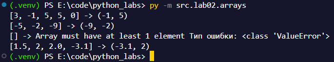
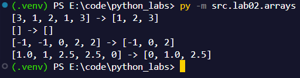
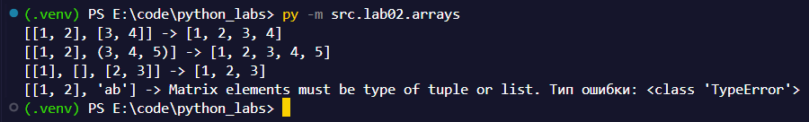
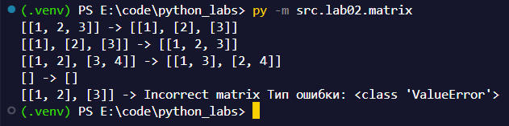
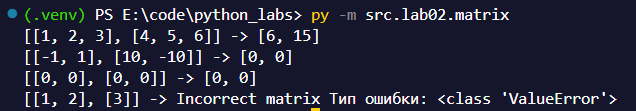
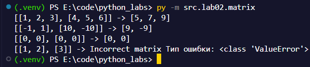
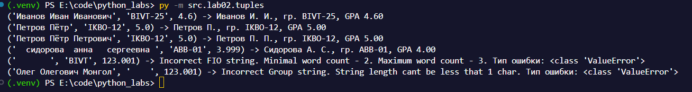

# ЛР-2 по ПиА

## Предисловие
Все, что обозначено "Элем. -> Элем." - Означает ввод -> вывод.

---
## FastTravel
- [Задание 1](#задание-1)
- - [min_max](#1-min_max)
- - [unique_sorted](#2-unique_sorted)
- - [flatten](#3-flatten)
-
- [Задание B](#задание-b)
- - [transpose](#1-transpose)
- - [row_sums](#2-row_sums)
- - [col_sums](#3-col_sums)
-
- [Задание C](#задание-c)
- [P.S.](#ps)

---

## Задание 1

### 1) min_max
Проверяет список на наличие как минимум 1 элемента и затем прочто через встроенные функции питона min и max возвращает соответсвующие значения.

Примеры запуска:

### 2) unique_sorted
Превращаю список в множество, чтобы убрать повторяющиеся элементы, сортирую, перевожу обратно в список и возвращаю.

Примеры запуска:

### 3) flatten
Пробегаюсь по списку фором и делаю 2 вещи: проверяю список ли это и добавляю все значения в список "a", который собственно и является ответом.

Примеры запуска:

## Задание B
Функция matrix_rows_checkup находится в lib/matrix.py

### 1) transpose
Проверяю, что матрица не сломанная, проверяю ее размер. Затем создаю новый шаблон при помощи генератора. Затем просто с помощью цикла записываю все первые элементы в список, затем вторые и так до конца.

Примеры запуска:

### 2) row_sums
Пробегаюсь генератором по строкам и с помощью sum считаю сумму.

Примеры запуска:

### 3) col_sums
То же самое, что и с row_sums, но перед суммированием переворачиваю матрицу с помощью transpose, который был написан ранее.

Примеры запуска:

## Задание C

У каждой функции описанно, что она делает. Но быстренько пробегусь по тому, как именно они работают.

1. fio_string_unwrapper - Разбирает строку с ФИО и переделывает ее в список и адекватный вид, то есть убирает лишние пробелы и пишет слова с большой буквы. Возвращает список из слов.

2. check_fio - Просто проверяет кол-во слов в ФИО. Если меньше 2х, то возвращает False, в противном случае True.

3. check_group - То же самое, что и с check_fio, только с группой. Просто проверяет длину строки, предварительно убрав лишние пробелы.

И теперь основная функция format_record.

Первый блок Checkers отвечает за проверку всех (ФИО и группу) значений на адекватность и правльность. В противном случае возвращает ValueError с подписью, что именно было передано неправльно.

Второй блок Formatting выполняет все остальный действия. Сначало создает final_fio, где удаляет все пробелы и собирает готовую строку имени. В общем делает все, что написано в пункте 1, но скоращает все слова, кроме первого, до 1 буквы. Затем просто форматирую строку под требования описанные в ТЗ и возвращаю.

Примеры запуска (В конце добавил 2 теста от себя):

# P.S.
LLM-ки не были использованы СОВСЕМ.