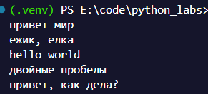
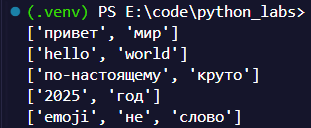
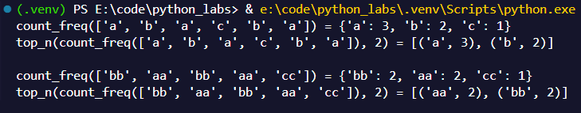
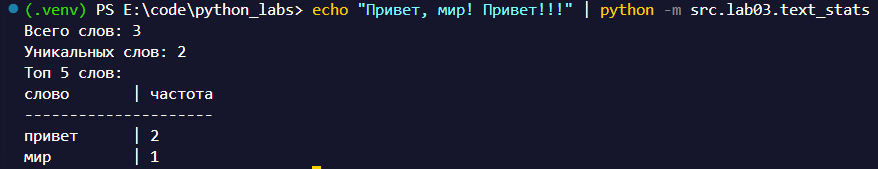

# ЛР03

# Важно
Все обьяснения записаны заранее в докстринги, а код вставлен в ридми, поэтому дополнительных обьяснений нет.

Для тестов есть файлик tests.py в котором есть ассерты из ТЗ.


# Fast Travel
[Задание А](#задание-а)
- [normalize](#normalize)
- [tokenize](#tokenize)
- [count_freq + top_n](#count_freq--top_n)

[Задание В](#задание-в)

---

# Задание А

## normalize

```py
def normalize(text: str, *, casefold: bool = False, yo2e: bool = True) -> str:
    """
    Функция для нормализации текста. Первые 2 ифа переводят текст (в зависимости от выбраного метода) и меняет ё на е.
    
    Дальше, с помощью регулярки, заменяем все управляющие символы на пробелы. (в юникоде с x00 по x1F включительно и отдельно симвод x7F который отвечает за уделение символа)
    
    Обработки ошибок у функции не предсмотренно
    
    normalize(text: str, *, casefold: bool = False, yo2e: bool = True) -> str
    
    """
    
    if casefold:
        text = text.casefold()
    else:
        text = text.lower()
    
    if yo2e:
        text = re.sub(r"ё", "е", text)
    
    return " ".join(re.sub(r"[\x00-\x1F\x7F]", " ", text).split())
```


Примеры запуска:




## tokenize

```py
def tokenize(text: str) -> list[str]:
    """
    здесь тоже очень просто.
    
    При помощи регулярки и функции finall ищем либо полностью слова, либо слова с дефисами, после которых обязательно идет еще слово. Ну и так пока не закончится трока (* в конце паттерна)
    
    Обработки ошибок у функции не предсмотренно
    
    tokenize(text: str) -> list[str]    
    """
    
    return re.findall(r"\w+(?:-\w+)*", text, flags=re.UNICODE)
```

Примеры запуска:



## count_freq + top_n

```py
def count_freq(tokens: list[str]) -> dict[str, int]:
    """
    Функция подсчета частоты слов в списке токенов.
    
    Просто бежит по списку и записывает все слова в словарь и потом его возвращает.
    
    Обработки ошибок у функции не предсмотренно
    
    count_freq(tokens: list[str]) -> dict[str, int]
    """
    
    freq_dict = {}
    
    for token in tokens:
        if token in freq_dict:
            freq_dict[token] += 1
        else:
            freq_dict[token] = 1
    
    return freq_dict


def top_n(freq: dict[str, int], n: int = 5) -> list[tuple[str, int]]:
    """
    Функция возвращает топ N слов по частоте встречаемости в виде списка кортежей (слово, частота)
    
    Сортировка идет по убыванию частоты, а при равной частоте - по алфавиту.
    При помощи безымянной функции сортируем словарь по значениям и ключам и возвращаем первые N элементов. 
    Минус у значения в сортировке нужен для того чтобы сортировка шла по убыванию, а не по возрастанию.
    
    Обработки ошибок у функции не предсмотренно
    
    top_n(freq: dict[str, int], n: int) -> list[tuple[str, int]]
    """
    
    return sorted(freq.items(), key=lambda x: (-x[1], x[0]))[:n]
```


Примеры запуска:




# Задание В

Код длинный, поэтому вот гиперссылка: [ТЫК](../../src/lab03/text_stats.py)

Коротко обьясню что и зачем.

Считываем stdin (нужно вручную перевести кодировку stdin и stdout консоли в UTF-8, так как код не предусматривает работу в других кодировках (например в виндовс по дефолту в консоли используется UTF-16 из-за чего может не читаться ввод или выдаваться полная билиберда))

Сначала нормализуем, токенизируем, считаем слова и ищем топ 5.

Логика создания таблицы прост. Считаем максимальную длину слов и добавляем туда еще 5 для красоты. И просто выравниваем все спомощью форматирования.
(что такое "-"*value я пожалуй обьяснять не буду)

Пример запуска:

